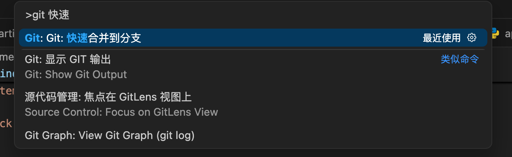
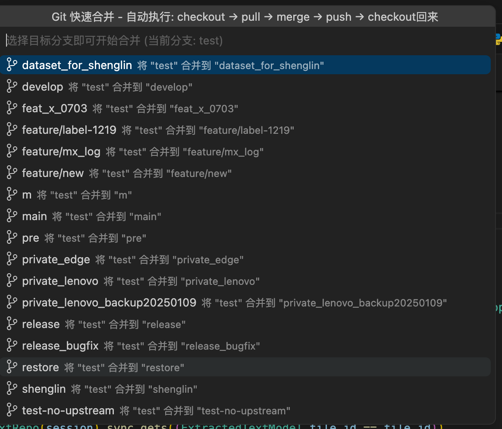
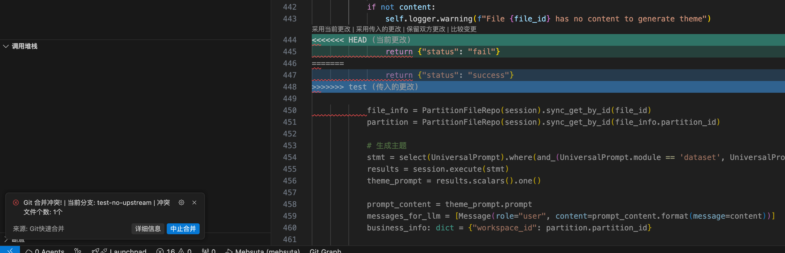
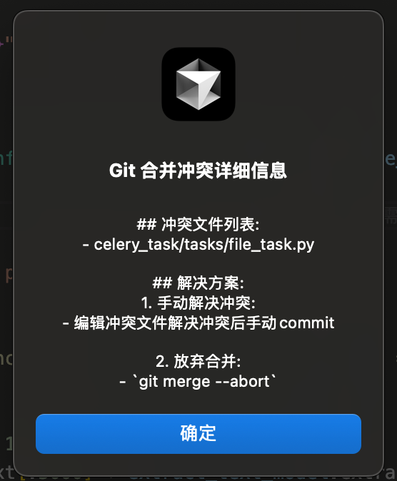

# Git 快速合并


这是一款VSCode插件
一键将当前分支合并到目标分支并推送，避免频繁切换分支的插件。
同步发布到open-vsx.org, cursor的应用商店也可以搜到了

另外还有一款类似的插件,用于支持jetbranins产品插件链接: https://github.com/ApexGust/git-merge-target


## ChangeLog
- 2025.07.01 支持vscode/cursor 工作区 管理多个项目

## ✨ 功能特性

- 🚀 **一键合并**: 选择目标分支即可自动执行完整的合并流程
- 🔄 **自动流程**: `checkout → pull → merge → push → checkout回来`
- ⚡ **智能处理**: 自动处理上游分支未设置的情况
- 🛡️ **冲突管理**: 智能检测合并冲突并提供解决方案
- 📊 **进度显示**: 实时显示操作进度和当前步骤
- 🎯 **用户友好**: 清晰的界面和操作指引

## 🎬 使用方法

### 📸 界面预览

**1. 打开命令面板**
cmd+shift+P 打开命令面板,输入 "git 快速"


**2. 选择目标分支**


**3. 遇到冲突**


**4. 冲突详情界面**


**5. 中止合并,并自动回到feature分支**


### 🚀 操作步骤

1. **打开命令面板**: `Cmd+Shift+P` (macOS) 或 `Ctrl+Shift+P` (Windows/Linux)
2. **输入命令**: `Git: 快速合并到分支`
3. **选择目标分支**: 从列表中选择要合并到的分支
4. **自动执行**: 插件会自动完成整个合并流程

### 📋 操作流程

插件会自动执行以下步骤：

```
1. 切换到目标分支     (git checkout target-branch)
2. 拉取远程更新       (git pull origin target-branch)  
3. 合并当前分支       (git merge current-branch)
4. 推送到远程         (git push origin target-branch)
5. 切回原始分支       (git checkout current-branch)
```

## 🛠️ 安装方式

### 方式1: VSCode 市场安装
1. 打开VSCode
2. 点击扩展图标 (或按 `Ctrl+Shift+X`)
3. 搜索 "Git快速合并"
4. 点击安装

### 方式2: 手动安装
1. 下载 `.vsix` 文件
2. 打开VSCode命令面板
3. 运行 `Extensions: Install from VSIX...`
4. 选择下载的文件

## ⚠️ 冲突处理

当发生合并冲突时，插件会：

1. **智能检测**: 自动识别合并冲突
2. **详细提示**: 显示冲突文件和当前分支信息
3. **解决选项**: 提供两个处理方案：
   - **手动解决**: 编辑冲突文件后手动commit
   - **中止合并**: 自动执行 `git merge --abort` 并切回原分支

## 🔧 特殊情况处理

### 上游分支未设置
如果目标分支没有设置上游分支，插件会：
- 询问是否设置 `origin/branch-name` 为上游分支
- 提供跳过拉取步骤的选项
- 允许取消操作

### 工作区有未提交更改
插件会检查工作区状态：
- 如有未提交更改，会询问是否继续
- 建议先提交或暂存更改

## 📝 需求条件

- VSCode 1.60.0 或更高版本
- Git 已安装并可在命令行中使用
- 当前工作区包含Git仓库

## 🎯 适用场景

- **功能开发**: 开发完成后快速合并到develop分支
- **热修复**: 紧急修复快速合并到release分支  
- **代码同步**: 定期将功能分支合并到主分支
- **团队协作**: 减少手动操作，提高工作效率

## 🔍 日志查看

插件提供详细的操作日志：

1. 打开输出面板: `Cmd+Shift+U`
2. 选择 "Git快速合并" 通道
3. 查看详细的执行日志和错误信息

## 🐛 问题反馈

如果遇到问题，请：

1. 查看输出面板的日志信息
2. 在 [GitHub Issues](https://github.com/your-username/git-merge-into-target/issues) 提交问题
3. 提供详细的错误信息和使用环境

## 📄 许可证

MIT License

## 🙏 致谢
